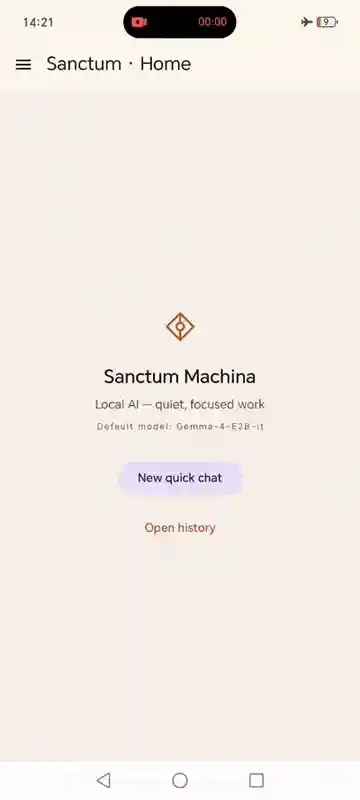

**English** | [Русский](README.ru.md)

# Sanctum Machina

> Local multimodal LLM client for Android. Models run entirely on-device — no cloud, no network, no telemetry.
>
> **Two variations of Gemma 4 in one on-device stack** — Gemma-4-E2B/E4B for chat, EmbeddingGemma-300M for retrieval. Load PDFs into a project, ask questions across the corpus, and every answer carries citation chips showing which chunk from which document the model retrieved.

A fork of [Google AI Edge Gallery](https://github.com/google-ai-edge/gallery) focused on LLM chat — with a custom UI, persistent chat history, an incognito quick-chat mode, and Projects with multi-PDF RAG.

---

## Demo

Airplane mode on; everything below runs without network:

Multiple persistent chats kept independent — switch from a Python codegen session to a privacy-first AI pitch (tagline → tweet → Spanish), then come back to the first chat and continue exactly where you left off. Each chat keeps its own KV-cache, settings, and message history:

**Projects + RAG over your PDFs.** Create a project, drop one or more PDFs into it, and every chat under that project auto-augments answers with retrieved chunks from the corpus. Citation chips under each assistant bubble point to the exact chunk in a specific document; the modal shows the raw chunk text so you can verify each claim.

## Status

**Pre-alpha / experimental.** APKs published in Releases are debug builds tagged `Pre-release`. The project name, architecture, and `applicationId` may still change; a future stable release **will not be able to upgrade** the currently installed APK — you will have to reinstall and lose local data (chat history, settings). Not intended for daily use.

## Install

APK files are on the [Releases](../../releases) page. Download the latest one, open it in a file manager on Android, and install. You will need to grant the "Install from unknown sources" permission.

## What it is

Built on the [LiteRT-LM](https://github.com/google-ai-edge/LiteRT-LM) engine: we own the model discovery, downloads, engine lifecycle, chat UI with persistent history, settings, and diagnostics. The engine and the models themselves are binary artifacts from Google and the community; we orchestrate them.

Projects + RAG (added in `v0.4.2-RAG`) layer a second runtime on top: EmbeddingGemma-300M runs on the LiteRT Interpreter API alongside the chat model on litert-lm, with each call sequence going through embed → cosine-retrieve top-K → prepend to prompt → generate. Embeddings, citations, and the PDF corpus stay in app-private storage; nothing about RAG ever touches the network.

## Features

**Chat:**

- On-device LLM inference (Android 12+).
- **Gemma 4** models (E2B, E4B) from the HuggingFace [`litert-community`](https://huggingface.co/litert-community) repository.
- Multimodal input: text, image (gallery / camera), short audio clip.
- Separate **reasoning channel** for models that support it.
- Per-model inference settings: temperature, top-K, top-P, context window, accelerator, system prompt.
- Persistent chat history with a sidebar drawer (rename, delete, sections by date), plus an incognito **quick-chat** mode.
- Pre-flight RAM gate — models that need more memory than the device has are blocked from download.
- Per-message metrics in the chat footer: TTFT and decode tok/s.
- Crash recovery, background model warm-up, diagnostic log export.

**Projects + RAG (`v0.4.2-RAG`):**

- **Multi-PDF per project** — load one or more PDFs into a project; every chat under that project retrieves chunks from the shared corpus on every send.
- **EmbeddingGemma-300M** for multilingual retrieval, bundled inside the APK — no HuggingFace authentication, no runtime download, no network for RAG.
- **Background ingest** via WorkManager foreground service — minimise the app, indexing continues with a persistent notification (live `page N · M chunks` counter).
- **Citation chips** under every assistant bubble — `[filename · p. N]`; tap opens a modal with the raw chunk text so you can verify each claim. Citations persist in the database and survive PDF deletion as muted "source removed" chips.
- **Per-project RAG settings** — chunk size, chunk overlap, top-K, embedding dim. Light changes apply instantly; structural changes (chunk size / overlap) trigger a full reindex with a confirmation dialog.

## Known issues

A few quirks and gaps that exist on day one — tracked, not surprises:

- **Only the first photo is saved to history when multiple are sent in one message** ([#4](../../issues/4)). All photos still flow into the model's reply; only history is single-image.
- **Tested only on Honor 200** ([#5](../../issues/5)) — other Android 12+ devices should work but are unverified; reports welcome.
- **APK size is ~357 MB.** EmbeddingGemma's `.tflite` (≈196 MB) and SentencePiece tokenizer model (≈4.7 MB) ship bundled inside the APK. This is deliberate — see Privacy.

## Privacy

- **Data never leaves the device.** No cloud sync, no telemetry, no analytics.
- **Google Auto Backup is disabled** — settings and history do not get uploaded to Google Drive.
- **PDFs you load into projects are processed entirely on-device** — text extraction, chunking, embedding, retrieval, generation all run locally. The PDF files live in app-private storage (`filesDir/projects/{id}/docs/`), the vector store lives in the local SQLite database, citations are persisted as JSON on the same database. RAG runs in airplane mode; no remote allowlist refresh, no telemetry around indexing or queries.
- Chat-model downloads from HuggingFace are the only network activity. They go directly to `litert-community/*` repos through a strict allowlist. **EmbeddingGemma is shipped bundled in the APK**, so RAG works the moment the app is installed — no download step, no auth flow, no network call.

## Tech stack

- **Platform:** Android, `minSdk 31`, `targetSdk 35`
- **Language / UI:** Kotlin, Jetpack Compose, Material 3
- **LLM engine (chat):** [LiteRT-LM 0.10.0](https://github.com/google-ai-edge/LiteRT-LM) (`.aar` from Google Maven)
- **LLM engine (RAG embedder):** [LiteRT Interpreter 2.1.4](https://ai.google.dev/edge/litert) — separate native runtime, co-resident with litert-lm
- **Embedder + tokenizer:** EmbeddingGemma-300M (`.tflite`, bundled) + pure-Kotlin SentencePiece BPE port (byte-identical to upstream `sentencepiece` 0.2.1 on EN/RU/BiDi fixtures)
- **PDF text extraction:** [`pdfbox-android` 2.0.27.0](https://github.com/TomRoush/PdfBox-Android) (Tom Roush fork, Apache 2.0)
- **DI:** Hilt
- **Storage:** Room (history, projects, embeddings; schema v2 since `v0.4.2-RAG`), DataStore + protobuf (settings)
- **Downloads / background ingest:** WorkManager (foreground services)
- **Bundled assets:** `embeddinggemma-300M_seq2048_mixed-precision.tflite` (≈196 MB, git LFS) + `sentencepiece.model` (≈4.7 MB)

**Building from source:** the repo uses git LFS for the bundled embedder. Run `git lfs install && git lfs pull` after cloning, before the first Gradle build — without it the APK compiles but the `.tflite` is replaced by a 130-byte LFS pointer and the embedder fails to initialise at runtime.

## License

[Apache License 2.0](LICENSE), inherited from upstream Google AI Edge Gallery. Attribution and modification notices are in [`NOTICE`](NOTICE).

## Attribution

- [Google AI Edge Gallery](https://github.com/google-ai-edge/gallery) — fork base.
- [LiteRT-LM](https://github.com/google-ai-edge/LiteRT-LM) and [LiteRT](https://ai.google.dev/edge/litert) — on-device inference runtimes (chat + embedder).
- [Gemma](https://ai.google.dev/gemma) — model family. Use of Gemma-4-E2B/E4B and EmbeddingGemma-300M is governed by the [Gemma Terms of Use](https://ai.google.dev/gemma/terms); the EmbeddingGemma `.tflite` is bundled inside the APK and attribution is also surfaced in-app on the About screen.
- [pdfbox-android](https://github.com/TomRoush/PdfBox-Android) — PDF text extraction (Tom Roush fork of Apache PDFBox).
