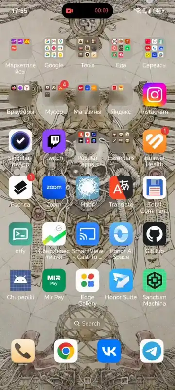
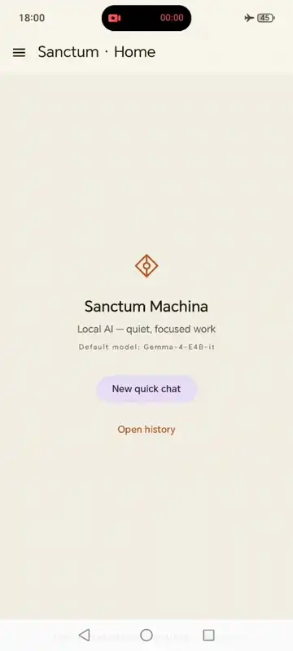

[English](README.md) | **Русский**

# Sanctum Machina

> Локальный мультимодальный LLM-клиент для Android. Модели работают целиком на устройстве — без облака, без сети, без телеметрии.

Форк [Google AI Edge Gallery](https://github.com/google-ai-edge/gallery), сфокусированный на LLM-чате — с собственным UI, persistent-историей чатов и инкогнито-режимом быстрого чата.

---

## Демо

Авиарежим включён; всё что ниже — работает без сети:

Несколько persistent-чатов держат состояние независимо — переключился с сессии Python codegen на pitch privacy-first AI приложения (tagline → твит → испанский), потом вернулся к первому чату и продолжил ровно с того места. У каждого чата — свой KV-cache, свои настройки, своя история:

## Статус

**Pre-alpha / экспериментально.** Публикуемые в Releases APK — debug-сборки с пометкой `Pre-release`. Имя проекта, архитектура и `applicationId` могут поменяться; будущая стабильная версия **не сможет обновить** установленную сейчас APK — потребуется переустановка с потерей локальных данных (история чатов, настройки). Не для повседневного использования.

## Установка

APK-файлы — на странице [Releases](../../releases). Скачайте последний, откройте в файловом менеджере на Android и установите. Потребуется разрешение «Установка из неизвестных источников».

## Что это

Построено вокруг движка [LiteRT-LM](https://github.com/google-ai-edge/LiteRT-LM): на нашей стороне — discovery моделей, загрузка, lifecycle движка, чат-UI с persistent-историей, настройки и диагностика. Движок и сами модели — бинарные артефакты от Google и сообщества; мы их оркестрируем.

## Возможности

- Локальный инференс LLM на устройстве (Android 12+).
- Модели **Gemma 4** (E2B, E4B) из репозитория HuggingFace [`litert-community`](https://huggingface.co/litert-community).
- Мультимодальный ввод: текст, изображение (галерея / камера), короткий аудио-клип.
- Отдельный канал **ризонинга** у моделей, которые его поддерживают.
- Настройки инференса per-model: temperature, top-K, top-P, max tokens, ускоритель, системный промпт.
- Persistent история чатов с боковым drawer-ом (переименование, удаление, разбивка по датам), плюс инкогнито-режим **быстрого чата**.
- Pre-flight RAM gate — модели, которым не хватает памяти устройства, блокируются от скачивания.
- Метрики в футере чата на каждое сообщение: TTFT и decode tok/s.
- Восстановление после крэшей, фоновый прогрев модели, экспорт диагностических логов.

## Известные проблемы

Несколько шероховатостей, которые есть на старте — отслеживаются, не сюрпризы:

- **SwiftKey оставляет зазор под полем ввода чата на Honor 200** ([#1](../../issues/1)). Особенность самой клавиатуры, не баг лэйаута приложения — на Gboard / системной клавиатуре зазора нет.
- **«Max tokens» управляет размером контекстного окна, а не длиной ответа** ([#2](../../issues/2)) — семантика upstream LiteRT-LM 0.10.
- **Сообщения чата нельзя скопировать или выделить** ([#3](../../issues/3)) — long-press пока не подключён.
- **Если в одном сообщении несколько фото — в историю сохраняется только первое** ([#4](../../issues/4)). Модель видит все фото и отвечает с их учётом; в истории остаётся только одно.
- **Тестировалось только на Honor 200** ([#5](../../issues/5)) — другие Android 12+ устройства должны работать, но не проверены; репорты приветствуются.

## Приватность

- **Данные не покидают устройство.** Нет cloud-sync, нет телеметрии, нет аналитики.
- **Google Auto Backup отключён** — настройки и история не уезжают в Google Drive.
- Скачивание моделей — единственное сетевое действие; идёт напрямую к HuggingFace по жёсткому allowlist'у.

## Технический стек

- **Платформа:** Android, `minSdk 31`, `targetSdk 35`
- **Язык / UI:** Kotlin, Jetpack Compose, Material 3
- **LLM-движок:** [LiteRT-LM 0.10.0](https://github.com/google-ai-edge/LiteRT-LM) (`.aar` с Google Maven)
- **DI:** Hilt
- **Хранилище:** Room (история), DataStore + protobuf (настройки)
- **Загрузки:** WorkManager (foreground service)

## Лицензия

[Apache License 2.0](LICENSE), унаследовано от upstream Google AI Edge Gallery. Атрибуция и сведения о модификациях — в [`NOTICE`](NOTICE).

## Атрибуция

- [Google AI Edge Gallery](https://github.com/google-ai-edge/gallery) — основа форка.
- [LiteRT-LM](https://github.com/google-ai-edge/LiteRT-LM) — рантайм on-device inference.
- [Gemma](https://ai.google.dev/gemma) — семейство моделей.
